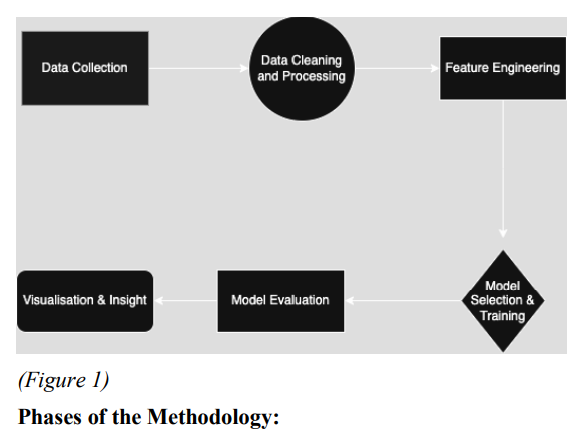
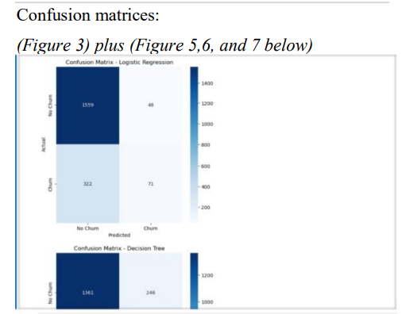
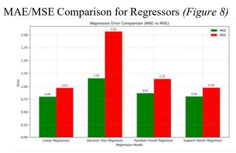
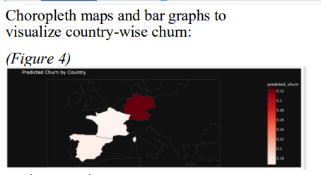
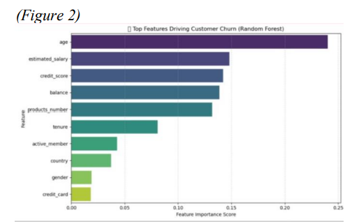

# Customer Churn Prediction Pipeline

End-to-end machine learning pipeline for customer churn prediction and credit behavior analysis in the financial sector.

---

## Project Overview

This project evaluates multiple classification and regression models on a banking customer dataset to:

- Predict customer churn (classification)
- Estimate credit score (regression)
- Identify high-risk regions (country-level churn analysis)
- Highlight key churn drivers (feature importance)

---

## Workflow

1. Data cleaning & encoding  
2. Feature scaling  
3. Train/test split  
4. Model benchmarking (multiple algorithms)  
5. Cross-validation (where applicable)  
6. Evaluation (accuracy, confusion matrix, MAE/MSE/R²)  
7. Insight extraction (country churn + feature importance)




---

## Churn Classification (Model Comparison)

Models compared:
- Logistic Regression
- Decision Tree
- Random Forest
- Support Vector Machine

Random Forest achieved the strongest accuracy (86.36%) based on the project evaluation.




---

## Credit Score Regression

Regression models tested:
- Linear Regression
- Decision Tree Regressor
- Random Forest Regressor
- Support Vector Regressor

Metrics:
- MAE
- MSE
- R²




---

## Country-Level Churn Insight

A churn risk comparison by country was generated to identify high churn regions.




---

## Feature Importance (Explainability)

Feature importance analysis highlights the strongest churn predictors (e.g., age, balance, products number).




---

## Tech Stack

- Python
- Pandas, NumPy
- Scikit-learn
- Matplotlib, Seaborn
- Plotly

---

## Dataset (Citation)

Dataset source (not included in repo):

Kaggle — Customer Churn Dataset  
https://www.kaggle.com/datasets/bhuviranga/customer-churn-data

To reproduce results:
1. Download `Bank.csv` from Kaggle  
2. Place it in: `data/Bank.csv`

---

## Collaboration

This was a collaborative project completed with **Damilare Ajiboye**.

We jointly:
- agreed project goals and analysis direction
- experimented with multiple training approaches and models
- evaluated results and refined outputs
- contributed to writing and finalising the technical report

---

## Repository Structure

```text
customer-churn-prediction-pipeline/
│
├── data/                # dataset (ignored by git)
│   └── Bank.csv
├── notebooks/
│   └── 01_end_to_end_churn_modeling.ipynb
├── report/
│   └── technical_report.pdf
├── docs/
│   └── screenshots/
│       ├── figure1_methodology.png
│       ├── figure2_feature_importance.png
│       ├── figure3_confusion_matrices.png
│       ├── figure4_choropleth.png
│       └── figure8_regression_metrics.png
├── .gitignore
└── README.md

---

## Quick Start

Clone the repository:

```bash
git clone https://github.com/mahi7903/customer-churn-prediction-pipeline.git
cd customer-churn-prediction-pipeline